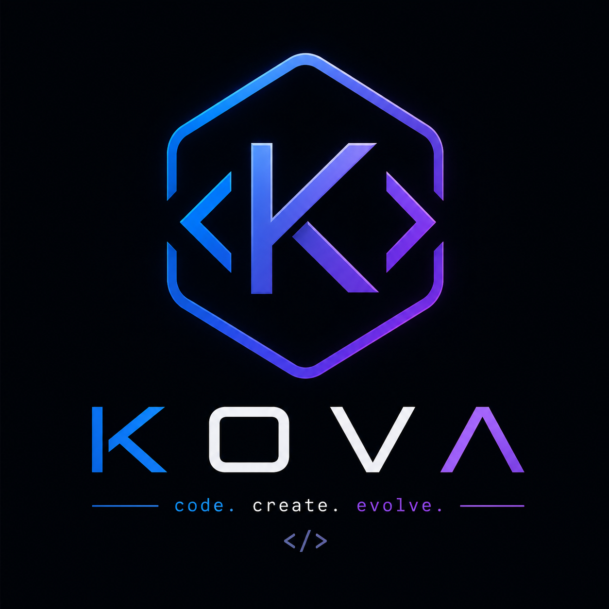

<!-- KOVΛ - code. create. evolve. -->

<p align="center">
  
</p>

<h1 align="center">KOVΛ</h1>

<p align="center">
  <strong>code. create. evolve.</strong>
</p>

<p align="center">
  <code>&lt;/&gt;</code>
</p>

<p align="center">
  <a href="#about">About</a> •
  <a href="#features">Features</a> •
  <a href="#quick-start">Quick Start</a> •
  <a href="#examples">Examples</a> •
  <a href="#roadmap">Roadmap</a> •
  <a href="#language-spec">Language Spec</a> •
  <a href="#contributing">Contributing</a>
</p>

---

## About

**KOVΛ** is a brand-new programming language built entirely from scratch by **Nguyễn Khôi**.

Every keyword is original — KOVΛ doesn't borrow syntax from any existing language. With **37 unique keywords**, a complete interpreter, and a rich standard library, KOVΛ is ready to use.

- 🧠 **Clarity** — Clean, readable syntax that makes intent obvious
- ⚡ **Performance** — Fast interpretation, smooth execution
- 🔧 **Versatile** — General purpose: web, apps, games, AI
- 🌍 **Open** — Open source, community driven
- 🛡️ **Secure** — Sandboxed I/O, recursion limits, loop guards

## Features

| Feature | Description |
|---|---|
| 🎯 Original Syntax | 37 unique keywords — `grab`, `forge`, `spin`, `morph`, `shape`, `evolve` |
| 🔄 Interpreter | Full Python-based interpreter (3000+ lines) |
| 📦 Auto Import | `pull` modules with circular import protection |
| 🧩 Data Types | Numbers, strings, booleans (`yes`/`no`), arrays, maps, `void` |
| 🎨 Variables | `grab` (mutable) / `lock` (immutable constants) |
| 🔨 Functions | `forge` to define, `yield` to return, closures, lambdas |
| 🔁 Loops | `spin` (for) / `orbit` (while) / `snap` & `skip` |
| 🔀 Conditionals | `test` / `also` / `rival` |
| 🧬 OOP | `shape` (class) / `evolve` (inherit) / `self` / `parent` |
| 🎭 Pattern Match | `morph` with default arm `_` |
| 🛡️ Error Handling | `attempt` / `rescue` / `eject` |
| 🔗 Pipe Operator | `value |> func1 |> func2` |
| ⏳ Defer | `defer { ... }` — cleanup at scope exit |
| 📝 String Methods | `.crush()` `.rise()` `.trim()` `.split()` `.has()` `.swap()` and more |
| 📋 Array Methods | `.map()` `.sift()` `.fold()` `.sort()` `.flip()` `.push()` `.pop()` and more |
| 🖥️ Interactive REPL | Colored prompt, multi-line support, command history |
| 🛡️ Security | Recursion limit, loop guards, sandboxed file I/O |
| 📚 45+ Built-ins | I/O, math, strings, arrays, files, functional, system |

## Quick Start

```bash
# Clone the repo
git clone https://github.com/phonmasverical/KOVA.git
cd KOVA

# Run a program
python kova.py hello.kv

# Launch interactive REPL
python kova.py

# Show version
python kova.py --version
```

## Examples

### Hello World
```
emit("Hello, World! 🌍")
```

### Variables & Constants
```
grab name = "KOVΛ"
lock VERSION = "1.0.0"
emit("Welcome to {name} v{VERSION}")
```

### Functions & Lambdas
```
forge factorial(n) {
  test n <= 1 { yield 1 }
  yield n * factorial(n - 1)
}
emit("5! = " + cast(factorial(5), "string"))

grab double = |x| => x * 2
emit(cast(double(21), "string"))
```

### Conditionals
```
grab score = 85
test score >= 90 {
  emit("Excellent!")
} also score >= 70 {
  emit("Good job!")
} rival {
  emit("Keep trying!")
}
```

### Loops
```
spin i from 1 to 5 { emit(i) }

grab colors = ["red", "green", "blue"]
spin c in colors { emit(c) }

grab x = 0
orbit x < 10 { grab x = x + 1 }
```

### OOP — Shapes & Evolve
```
shape Animal {
  forge init(name, sound) {
    self.name = name
    self.sound = sound
  }
  forge speak() {
    emit(self.name + " says " + self.sound)
  }
}

evolve Dog from Animal {
  forge init(name) {
    parent.init(name, "Woof!")
  }
}

grab dog = Dog("Rex")
dog.speak()
```

### Pattern Matching
```
morph 404 {
  200 => emit("OK")
  404 => emit("Not Found")
  _ => emit("Unknown")
}
```

### Error Handling
```
attempt {
  eject "Something went wrong!"
} rescue err {
  emit("Caught: " + err)
}
```

### Array Methods & Functional
```
grab nums = [1, 2, 3, 4, 5]
grab result = nums.sift(|x| => x % 2 == 0).map(|x| => x * 10)
emit(cast(result, "string"))
```

> 📂 See all 9 example programs: `hello.kv`, `variables.kv`, `functions.kv`, `loops.kv`, `oop.kv`, `pattern_matching.kv`, `error_handling.kv`, `advanced.kv`, `calculator.kv`

## Language Spec

📖 Full specification: **[language-spec.md](language-spec.md)** — covers all 37 keywords, data types, operators, control flow, OOP, modules, built-in functions, and more.

### All 37 KOVΛ Keywords

| Keyword | Purpose | Keyword | Purpose |
|---|---|---|---|
| `grab` | mutable variable | `lock` | constant |
| `forge` | define function | `yield` | return value |
| `test` | if | `also` | else if |
| `rival` | else | `spin` | for loop |
| `orbit` | while loop | `snap` | break |
| `skip` | continue | `shape` | class |
| `evolve` | inherit | `self` | this |
| `parent` | super | `attempt` | try |
| `rescue` | catch | `eject` | throw |
| `pull` | import | `expose` | export |
| `morph` | match/switch | `defer` | scope cleanup |
| `yes` | true | `no` | false |
| `void` | null | `and` / `or` / `not` | logic |

## Roadmap

- [x] Design language syntax & 37 unique keywords
- [x] Create GitHub repository
- [x] Write Language Specification v1.0
- [x] Build lexer (tokenizer)
- [x] Build parser (AST generator)
- [x] Build interpreter (3000+ lines)
- [x] 45+ built-in functions
- [x] String & array dot-notation methods
- [x] Interactive REPL
- [x] 9 example programs
- [x] Security features (recursion/loop limits, sandboxed I/O)
- [ ] Package manager
- [ ] Documentation website
- [ ] VS Code extension

## Contributing

KOVΛ is open source. All contributions are welcome!

1. Fork the repo
2. Create a new branch (`git checkout -b feature/new-feature`)
3. Commit your changes (`git commit -m 'Add new feature'`)
4. Push to the branch (`git push origin feature/new-feature`)
5. Open a Pull Request

## Author

**Nguyễn Khôi** — Creator & Lead Developer

## License

MIT License © 2026 Nguyễn Khôi

---

<p align="center">
  <sub>Built with ❤️ by Nguyễn Khôi</sub>
</p>
